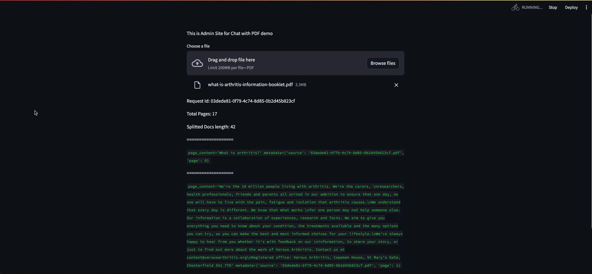
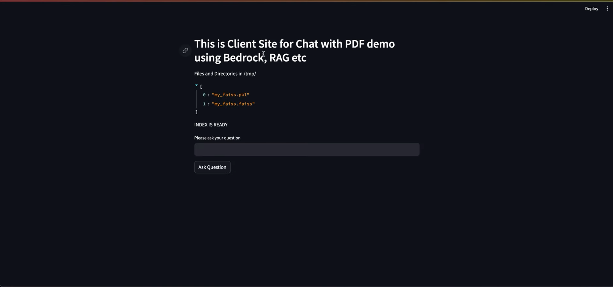

## Chat with your PDF: Seamlessly interact with documents using Amazon Bedrock, RAG, S3, Langchain, and Streamlit for intelligent, responsive conversations.

### Architecture


### Admin Interface


### Client Interface


PDFPal is a web application designed for processing PDF files. It offers two main components:

- **Admin Interface**: For processing PDFs, creating a vector store, and uploading it to Amazon S3.
- **User Interface**: For interacting with the processed PDFs and vector store.

## Getting Started

Follow the instructions below to set up and run both the Admin and User components of the application.

### Prerequisites

- **Python 3.11** or later (if not using Docker)
- **Docker** (if using Docker)
- **Amazon S3** account and bucket for storing vector store files
- **AWS CLI** installed for configuring AWS credentials

### Configuration

1. **Configure AWS CLI**:

   Ensure you have AWS CLI installed and configured. Run the following command to set up your AWS credentials:

   ```cmd
   aws configure
   ```
You will need to provide your AWS Access Key ID, Secret Access Key, region, and output format.

### Setup Instructions
## For Both User and Admin
1. **Clone the Repository**:

```cmd
git clone https://github.com/your-repository-url
cd your-repository-directory
```

2. **Install Dependencies**:

Create a requirements.txt file with the following content:

```
Copy code
boto3
streamlit
faiss-cpu
langchain
langchain-community
```
Then, install the dependencies using:

```cmd
pip install -r requirements.txt
```
### Using Docker
1. **Build Docker Images**:

For the Admin Interface:

```cmd
docker build -t pdfpal-admin .
```
For the User Interface:

```cmd
docker build -t pdfpal-user .
```
2. **Run Docker Containers**:

For the Admin Interface (accessible at http://localhost:8083):
```cmd
docker run -p 8083:8083 pdfpal-admin
```

For the User Interface (accessible at http://localhost:8084):
```cmd
docker run -p 8084:8084 pdfpal-user
```

### Using the Application
**Admin Interface**:

- Upload a PDF: Use the file uploader widget to select and upload a PDF file.
- Process PDF: The application will process the PDF, split its content, create a vector store, and upload it to S3.

**User Interface**:

- Interact with Processed PDFs: Access the processed PDFs and vector store as needed.

**Troubleshooting**:

- No Response from App: Ensure the application is running by checking the terminal output.
- File Upload Issues: Make sure the file is in PDF format.
- S3 Errors: Verify AWS credentials and S3 bucket permissions.


